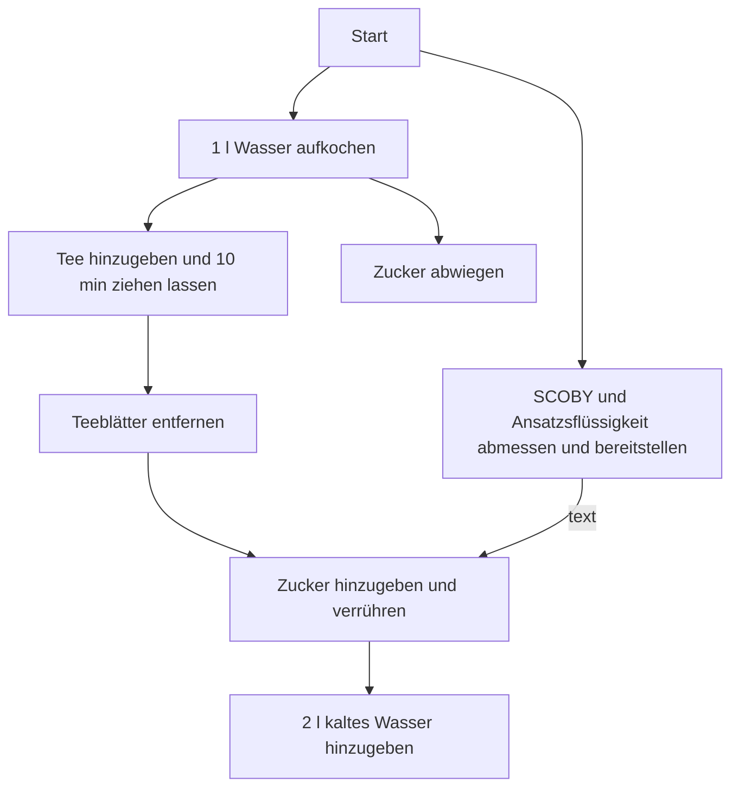

Fast jeder hat schon davon gehört oder kennt jemand der es mal ausprobiert hat.
Manche haben auch schon probiert. Entweder eine industriell abgefüllte
Version oder eine übergärige (...kommt noch) Flasche in einem
veganen Hipster Cafe.

<!-- ## Braumethoden -->
<!-- ### Batch -->
<!-- ### Kontinuerlich  -->
# 1. Fermentation 
## Rezept
### Kräuter-Kombucha
| Wieviel   | Einheit   | Was |
| --------- | --------- | --- |
| 8         |  Beutel (2 gr) | nicht-aromatisierter Kräuter-Tee |
| 200       | Gramm     | weißer, raffinierter Zucker |
| 250       | Mililiter | reife, saure Ansatzflüssigkeit |
| 1         | Stück     | SCOBY |

### Schwarzee-Kombucha
| Wieviel   | Einheit   | Was |
| --------- | --------- | --- |
| 10         |  Beutel (2 gr) | Darjeeling |
| 200       | Gramm     | weißer, raffinierter Zucker |
| 250       | Mililiter | reife, saure Ansatzflüssigkeit |
| 1         | Stück     | SCOBY |

## Anleitung
Da ich persönlich der Ansicht bin, denn Tee abzuschrecken anstatt langsam auf
Zimmertemperatur abkühlen zu lassen, beschreibe ich in der Anleitung auch nur diesen Fall.

